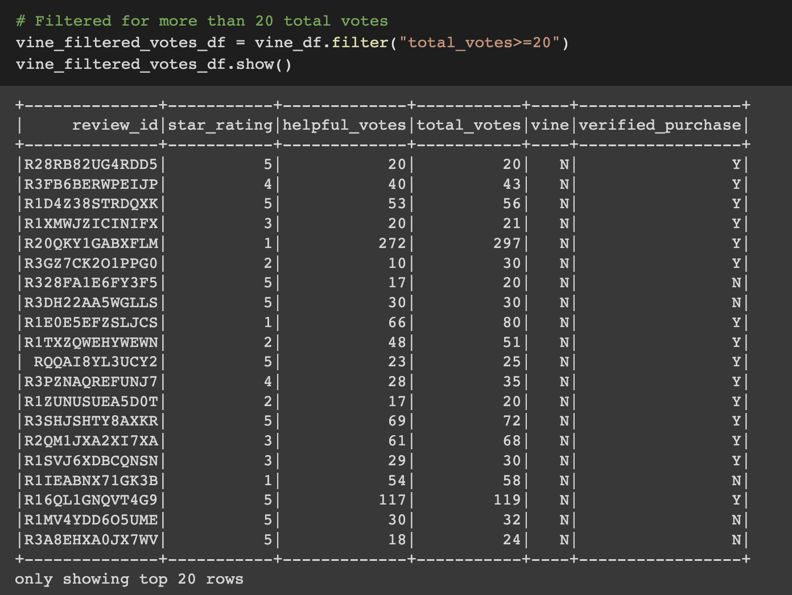
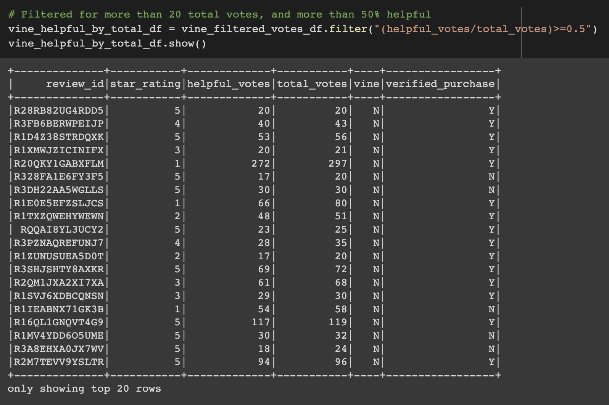
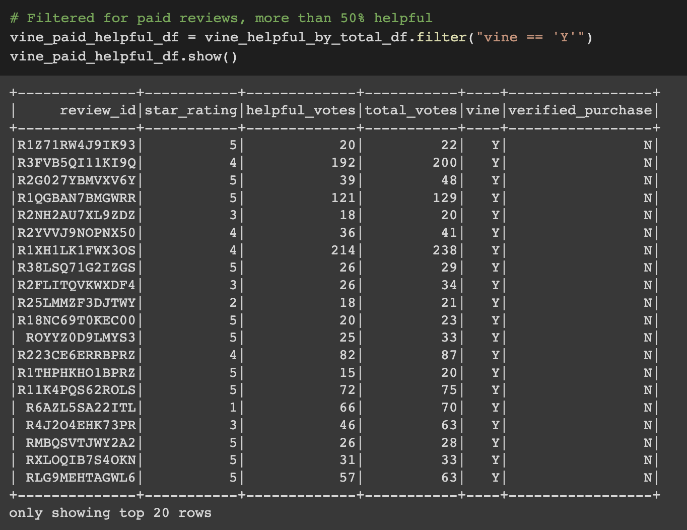
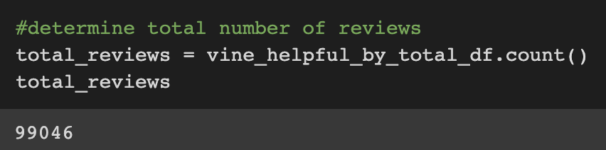
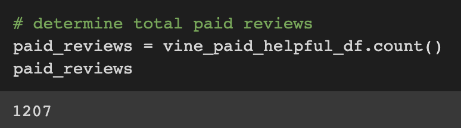
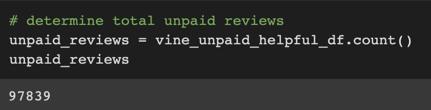
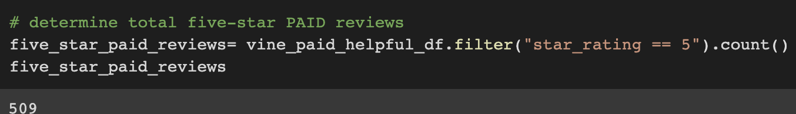
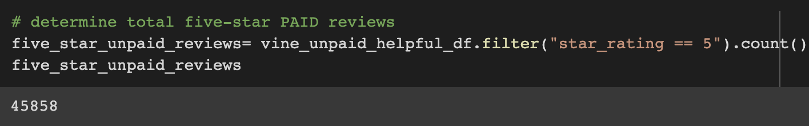
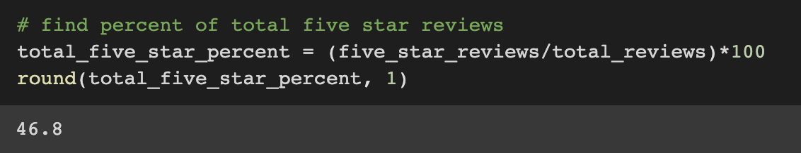

# Amazon Vine Analysis
## Overview of the analysis of the Vine program:
We will be analyzing a Amazon Review dataset. Some of the reviews will be coming from unpaid, non-Vine app users and others from a paid app called Vine. Vine is a company pays its members to write reviews on products and collects the data to allow manufacturing companies and sellers to retrieve the data and improve the product or market it better. Vine members MUST write reviews on all of the products they receive unlike non-Vine customers.

In this analysis, we have chosen to access a dataset for product reviews categorized under "Kitchen". We will perform ETL (Extract, Transform, and Load) by connecting to an AWS RDS instance and loading it into a pgAdmin. We will also be using PySpark to determine if there is any bias towards reviews. Our summary will analize our results and determine if there is bias and provide an additional analysis.

#### Criteria for Reviews taken into consideration as a viable review

- total_votes must be > 20 AND

- helpful_votes is 50% or more of the total votes AND

- whether or not it was a Vine OR non-vine customer review

#### Criteria for 5-Star Reviews
- ALL Criteria above AND
- star_rating is exactly 5

## Results:
#### Total Reviews
- How many Vine reviews and non-Vine reviews were there?
There were a total of 99,046 reviews in the dataset for Kitchen products; 1,207 were paid Vine reviews and 97,839 were unpaid noon-Vine reviews.

#### 5-Star rating reviews
- How many Vine reviews were 5 stars? How many non-Vine reviews were 5 stars?
Of the 1,207 paid Vine reviews, 509 of them were 5-Star reviews. When looking at the unpaid (non-vine) reviews, 45,858 of the 99,046 were 5-Star ratings in the review.

- What percentage of Vine reviews were 5 stars? What percentage of non-Vine reviews were 5 stars?
Using the percentage formula of (the part)/(the whole), we can find the following percents: total percentage of 5-star reviews is 46.8%, percentage of 5-star Vine reviews out of total Vine reviews is 42.2%, and total 5-star non-Vine reviews out of total non-Vine reviews is 46.9%.

## Summary:
When analyzing the results from the reviews written on kitchen products, it appears there is little difference in the percentage of 5-Star reviews from customers on the paid Vine app verse the updaid non-Vine customers since 42.2% (Vine) and 46.9% (non-Vine) are both close to the 46.8% (total) of customers who reviewed the products and gave 5-Star reviews. Additional tests should be run on products of each other value of stars (4-0 stars) to see if there are similar patterns of bias or unbias reviews between the Vine reviews and non-vine reviewers for each rating.
